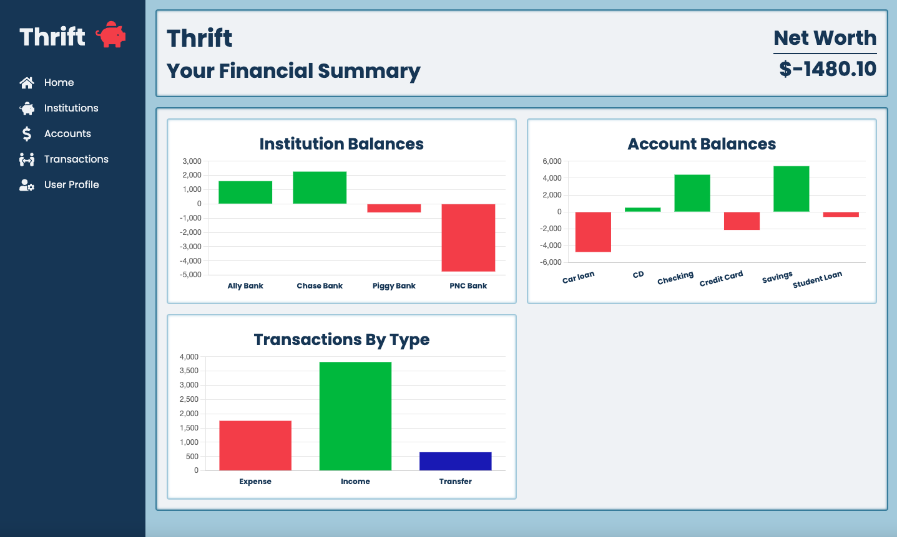
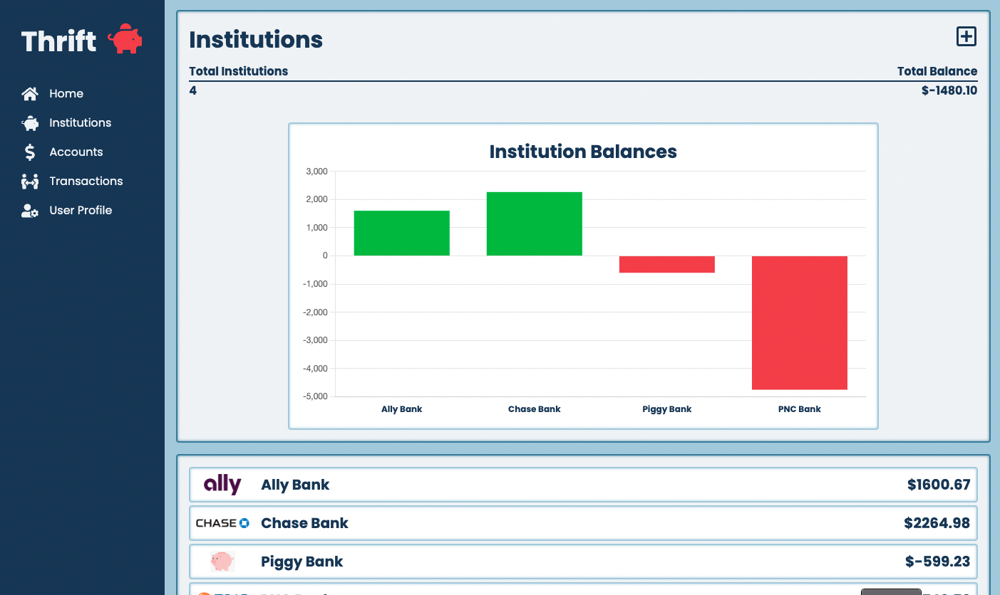
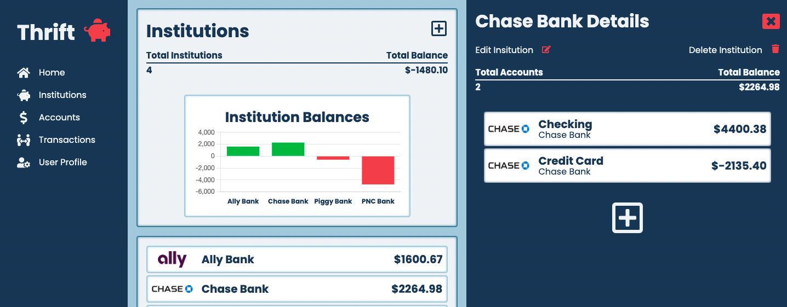
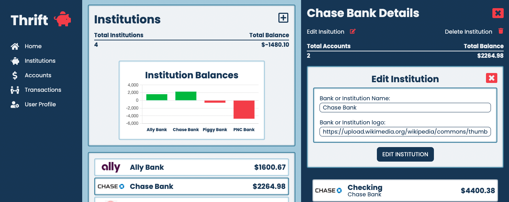
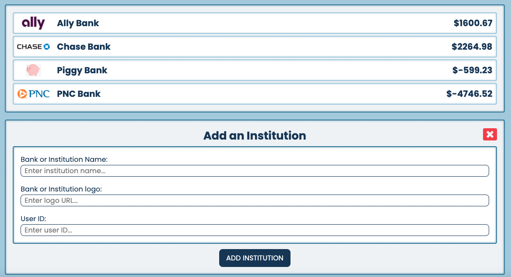

# Thrift
Thrift is a money-tracking web application built using the PERN stack (PostgreSQL, Express.js, React.js, Node.js). Users will be able to track their transactions, accounts, and the institutions that they belong to. Some basic charts are also implemented. Stretch goals will include adding budgeting tools, making the site responsive, and connecting to Plaid's API (an API that connects your account to your real-time banking information).

## Links to Project
[Thrift Frontend - Github](https://github.com/siemenjm/frontend-thrift)

[Thrift Backend - Github](https://github.com/siemenjm/backend-thrift)

[Thrift - Netlify Deployment](https://thrift-financial.netlify.app/)

[Thrift - Heroku Deployment](https://backend-thrift.herokuapp.com/)

## MVP User Stories
As a user, I want to be able to:
* View all of my banks, accounts, and transactions
* View details of each individual bank, account, and transaction
* Create new banks, accounts, and transactions
* Update my current banks, accounts, and transactions
* Delete my current banks, accounts, and transactions
* Implement a charting library to better view data

## Getting Started
At the moment, Thrift does not have user auth in place, so you do not need to log in. The home page shows your net worth and a basic overview of your institutions, accounts, and transactions.

By using the sidebar navigation links, you can view a more in-depth information about your finances. A basic chart is shown, along with a list of the institutions, accounts, transactions, etc...

By clicking on one of the list items, you will open up a details screen for that specific list item. This will show all the resources associated with this list item, along with a basic summary. You can also edit and delete the list item from this screen.

Finally, to add a new resource, all you have to do is click the plus button in either the main section or the details section. This will bring up a create form, allowing you to add a new resource to the database. 

## ERD

## Technologies Used
* React
* Node.js
* Express.js
* PostgreSQL
* JavaScript
* CSS

## Stretch Goals
This project is definitely a work in progress, and I am planning on implementing more features in the future, especially user auth. Hooking the app up to Plaid is also a goal of mine.

* Add user auth
* Add custom categories and sub-categories
* Add ability to create budgets and set spending limits for categories
* Connect to Plaid API to auto-update transactions

## Want to contribute?
If you notice any of the many bugs, or have feature suggestions, please reach out to me at contact@jaredsiemen.com.
